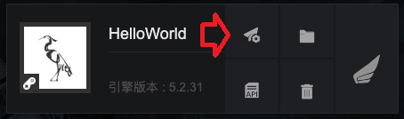

# 项目发布设置使用说明

---

此文档旨在帮助用户顺利的完成项目打包发布，解决发布过程中可能遇到的问题，并最终完成发布工程的个性化配置和功能接入，文档分为以下几个部分：

> * 发布设置前的准备工作
> * 项目发布配置
> * 发布工程的个性化配置
> * JS和原生的通信接入
> * 运行时error事件和state事件处理方法
> * 添加loading界面

---

## 发布设置前的准备工作

- 安装最新版本的launcher
- 确认引擎版本
    - 下载的引擎版本必须为***5.1.6及以上***
    - 在launcher中的引擎页选择下载
- 安装Android Studio
    - 最低版本: 3.0或以上
    - 后续需要在Android Studio中完成发布项目的修改和功能接入  
    
---

## 项目发布配置

### 1. 创建项目

- launcher项目页中，点击创建项目，填入项目名称，并选择引擎版本为5.1.6（或以上），点击创建按钮。

>此文档不涉及具体项目功能，可以关闭 Egret Wing窗口。

### 2. 发布配置

- 在launcher的项目页中找到新创建的项目，点击该项目下的发布设置按钮。

- 点击左侧的Android按钮，然后在右侧页面中，输入应用名称，填写新的应用包名，点击确定。
- 新弹出的窗口中选择点击***打开文件夹***按钮。

---

## 发布工程的个性化配置

- 使用Android Studio打开项目

- 修改Gradle配置
    > 查看在线文档[Android Gradle 配置FAQ](https://docs.egret.com/native/docs/manual/gradle)

- 在project Structure中配置SDK和NDK的合理路径
- 个性化设置
    - 修改游戏地址：将函数`nativeAndroid.initialize`的参数替换为当前游戏的地址。

    > 需要注意，如果工程的assets目录下存在game文件，那么此处填写的游戏必须和game文件中的游戏保持一致，否则会出现问题。

    - 控制FPS面板的显示：修改`nativeAndroid.config.showFPS = true/false;`。true为显示，false为隐藏。
    - 控制log在屏幕上的显示时间：修改`nativeAndroid.config.fpsLogTime = 30;`，改为`-1`时是永久显示。
    - 是否禁用核心渲染驱动：修改`nativeAndroid.config.disableNativeRender = false/true`。false为启用核心渲染驱动，true为禁用核心渲染驱动。
    - 是否清理缓存：修改`nativeAndroid.config.clearCache = false/true;`。false为不自动清理缓存，true为自动清理缓存。
    - 控制页面超时时间：修改`nativeAndroid.config.loadingTimeout = 0;`。单位为秒，0为不设置超时。
    - 沉浸模式，隐藏系统UI：修改`nativeAndroid.config.immersiveMode = true;`。开启沉浸模式。
    - 游戏是否支持刘海屏显示：修改`nativeAndroid.config.useCutout = true;`。true 为游戏支持并适配，false为不支持。必须开启沉浸模式。
---

## JS和原生的通信接入

### 1. 原生部分
- 在mainActivity的`setExternalInterfaces`方法里配置通信接口
    - `nativeAndroid.setExternalInterface` 注册JS中可以调用的原生函数
    - `nativeAndroid.callExternalInterface`调用JS函数
- `setExternalInterface`方法的第一个参数是JS中调用原生函数的函数名，第二个参数是该原生函数的功能实现
- `callExternalInterface`方法的第一个参数是JS函数的函数名，第二个传入的参数

```java
private void setExternalInterfaces() {
    nativeAndroid.setExternalInterface("sendToNative", new INativePlayer.INativeInterface() {
        @Override
        public void callback(String message) {
            String str = "Native get message: ";
            str += message;
            Log.d(TAG, str);
            nativeAndroid.callExternalInterface("sendToJS", str);
        }
    });
}
```

### 2. JS部分

- `egret.ExternalInterface.call`调用注册过的原生函数

```js
egret.ExternalInterface.call("sendToNative", "message from JS");
```

- `egret.ExternalInterface.addCallback`注册原生中可以调用的JS函数

```js
function sendToJS(msg) {
    console.log(msg);
}
egret.ExternalInterface.addCallback("sendToJS", sendToJS);
```

> 只有通过`setExternalInterface`注册的原生函数，才能在JS中通过`call`调用。
> 只有通过`addCallback`注册的JS函数，才能在原生中通过`callExternalInterface`调用。

---

## runtime阶段状态定义

- 我们将runtime启动及运行的阶段进行了定义，主要分为如下几种阶段状态：

> * loading:  系统初始时的默认状态
> * starting: 表示index.html已经加载成功
> * running:  表示starting状态后，执行完json、js等文件资源加载并开始执行渲染

## 运行时state事件处理方法

### 1. runtime运行中各个事件的说明
- 事件说明如下

|事件类型      |事件消息                     |所属阶段           |事件意义                                                                                    |
|:-------------|----------------------------|:-----------------|:-----------------------------------------------------------------------------------------|
|@onState      |{"state”:”starting”}        |loading到starting |index.html加载成功                                                                          |
|@onState      |{"state”:”running”}         |starting到running |starting状态后开始执行渲染(注：starting状态后，若json或js等文件加载失败，会通过具体的js错误进行提示)  |

### 2. 监听state事件的方法

- 注册对state事件的监听，在函数`setExternalInterfaces`中：

```java
private void setExternalInterfaces() {
    // handle the state change Event during the running
    nativeAndroid.setExternalInterface("@onState", new INativePlayer.INativeInterface() {
        @Override
        public void callback(String message) {
            String str = "Native get onState message: ";
    
            try{
                JSONObject jsonObject = new JSONObject(message);
                String state = jsonObject.getString("state");
                switch (state) {
                    case "starting":// 正在启动引擎
                        Log.e(TAG, "Engine starting");
                        break;
                    case "running": // 引擎开始渲染
                        // 如果您使用了自定义闪屏，这里是关掉的好时机
                        Log.e(TAG, "Engine is rendering");
                        break;
                    default:
                        break;
                }
            }
            catch (JSONException e) {
                Log.e(TAG, " onState message failed to analyze");
            }
    
            str += message;
            Log.e(TAG, str);
        }
    });
}
```

---

## 处理错误

如果您需要处理错误，请参照 [Egret Native 上处理游戏错误](https://docs.egret.com/native/docs/manual/abouterrors)。

---

## 添加loading界面

>loading界面的使用依赖与state事件的处理，请先完成上一部分的阅读。

### 1. 打开loading界面

- 在MainActivity的onCreate函数中调用函数showLoadingView

```java
private ImageView launchScreenImageView = null;
private FrameLayout rootLayout = null;

protected void onCreate(Bundle savedInstanceState) {
        super.onCreate(savedInstanceState);
        
        ....
        
        setContentView(nativeAndroid.getRootFrameLayout());

        rootLayout = nativeAndroid.getRootFrameLayout();
        showLoadingView();
    }
    
private void showLoadingView() {
    launchScreenImageView = new ImageView(this);
    Resources res = getResources();
    Drawable drawable = res.getDrawable(R.drawable.bg);
    launchScreenImageView.setImageDrawable(drawable);

    FrameLayout.LayoutParams params = new FrameLayout.LayoutParams(FrameLayout.LayoutParams.MATCH_PARENT,
            FrameLayout.LayoutParams.MATCH_PARENT);
    rootLayout.addView(launchScreenImageView, params);
}
```

### 2. 关闭loading界面

- 收到{"state”:”running”}消息后，调用函数hideLoadingView

```java
private void hideLoadingView() {
    rootLayout.removeView(launchScreenImageView);
    Drawable drawable = launchScreenImageView.getDrawable();
    launchScreenImageView.setImageDrawable(null);
    drawable.setCallback(null);
    launchScreenImageView = null;
}
```
